# Fraud Detection Project README

## Business Understanding

Fraud detection is a critical task in various industries such as banking, finance, and e-commerce. Detecting fraudulent activities early can save businesses significant losses and maintain trust with customers. In this project, we aim to develop a fraud detection model using machine learning techniques to identify potentially fraudulent transactions.

## Exploratory Data Analysis Writeup
Exploratory Data analysis has been performed on the selected data set and results from the analysis are published here in a separate readme file to avoid overloading this file with graphs and notes.

[readme-EDA.md](readme-EDA.md)

## Modelling

### Models Used
The following models were trained and evaluated for fraud detection:

- Logistic Regression
- K-Nearest Neighbors (KNN)
- Random Forest Classifier
- Gradient Boosting Classifier
- Decision Tree Classifier
- Neural Network
- Balanced Random Forest Classifier 

### Techniques Followed for Modeling
**Data Splitting:** The dataset was split into training and test sets using train_test_split from `sklearn.model_selection`.  The data was split into training (70%) and testing (30%) sets.\
**Hyperparameter Tuning:** For models where hyperparameter tuning was feasible, GridSearchCV was employed to find the best set of parameters. \
**Model Training:** Each model was trained on the training set and the best hyperparameters were selected where applicable. \
**Model Evaluation:** The models were evaluated on the test set using various metrics including accuracy, precision, recall, F1 score, and ROC-AUC score. ROC curves and confusion matrices were plotted for each model.

### Modelling Details for each model

#### *Base Model - Logistic Regression*
**Hyperparameters:** Not Applicable \
**Best Estimator:** Not Applicable since this is base model without grid search cv and hyperparameter tuning. \
**Results:** Accuracy: 0.9946, Precision: 0.5544, Recall: 0.3856, F1 Score: 0.4548 \
**Confusion Matrix:** 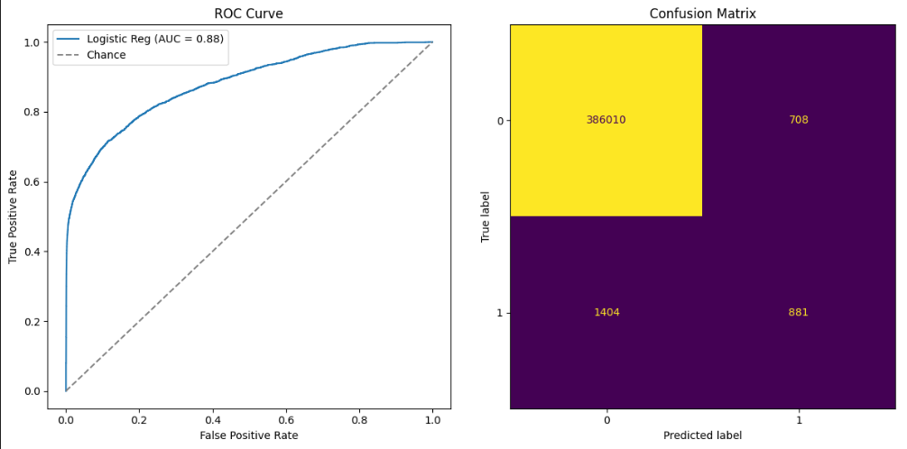

#### *Logistic Regression*
**Hyperparameters:** C, max_iter, class-weight \
**Best Estimator:** `LogisticRegression(C=10, class_weight={0: 1, 1: 0.5}, max_iter=5000, n_jobs=-1)` \
**Results:** `Accuracy: 0.9949, Precision: 0.7033, Recall: 0.2158, F1 Score: 0.3302` \
**Confusion Matrix:** 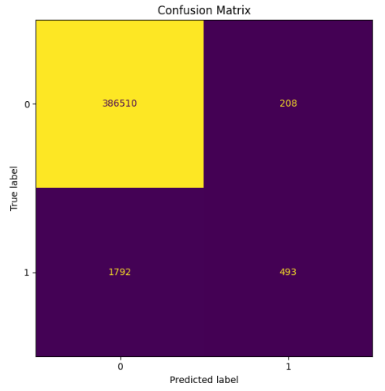

#### *K-Nearest Neighbors* 
**Hyperparameters:** n_neighbors \
**Best Estimator:** `KNeighborsClassifier(n_jobs=-1, n_neighbors=3)`\
**Results:** `Accuracy: 0.9941, Precision: 0.5009, Recall: 0.7536, F1 Score: 0.6018` \
**Confusion Matrix:** 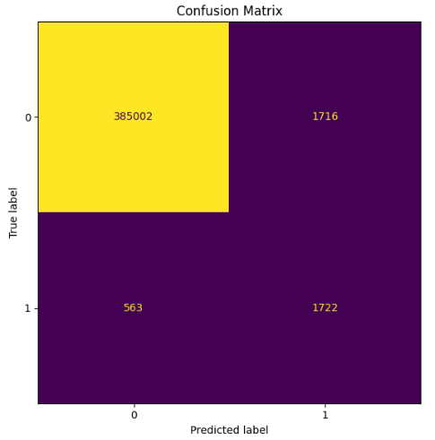

#### *Random Forest* 
**Hyperparameters:** n_estimators, max_depth \
**Best Estimator:** `RandomForestClassifier(n_estimators=300)` \
**Results:** `Accuracy: 0.9964, Precision: 0.6363, Recall: 0.9033, F1 Score: 0.7466`\
**Confusion Matrix:** 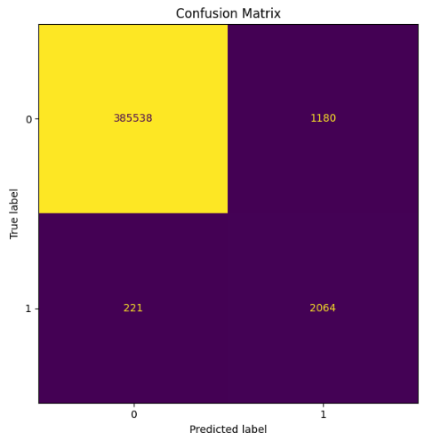

#### *Gradient Boosting*
**Hyperparameters:** n_estimators, learning_rate, max_depth, subsample \
**Results:** `Accuracy: 0.9975, Precision: 0.7297, Recall: 0.9225, F1 Score: 0.8148`\ 
**Confusion Matrix:** 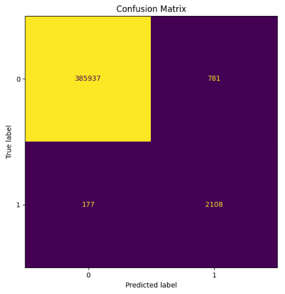

#### *Decision Trees*
**Hyperparameters:** max_depth
**Best Estimator:** `DecisionTreeClassifier(max_depth=12)` \
**Results:** `Accuracy: 0.9978, Precision: 0.7960, Recall: 0.8420, F1 Score: 0.8184`
**Confusion Matrix:** 

#### Neural Networks:
**Hyperparameters:** batch_size, epochs \
**Results:** `Accuracy: 0.9982, Precision: 0.8972, Recall: 0.7755, F1 Score: 0.8319` \
**Confusion Matrix:** 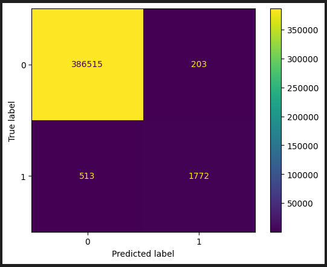

#### *Balanced Random Forest*
**Hyperparameters:** n_estimators, 'max_depth','min_samples_split', 'class_weight'\
**Best Estimator:** `BalancedRandomForestClassifier(class_weight='balanced', n_jobs=-1, replacement=True, sampling_strategy='all')` \
**Results:** `Accuracy: 0.8563, Precision: 0.0391, Recall: 0.9961, F1 Score: 0.0753`
**Confusion Matrix:**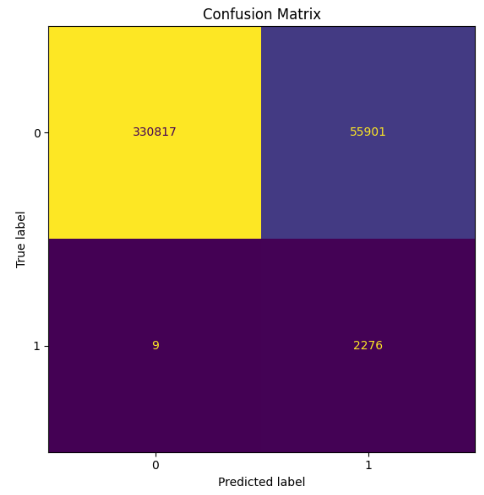

### Confusion Matrices and ROC Curves
For each model, confusion matrices and ROC curves were plotted to visualize the performance. The confusion matrix helps to understand the true positives, false positives, true negatives, and false negatives. The ROC curve illustrates the true positive rate against the false positive rate at various threshold settings.

### Results-Comparison
The results of the model evaluations are summarized below:

**Accuracy:** Indicates the proportion of correct predictions. \
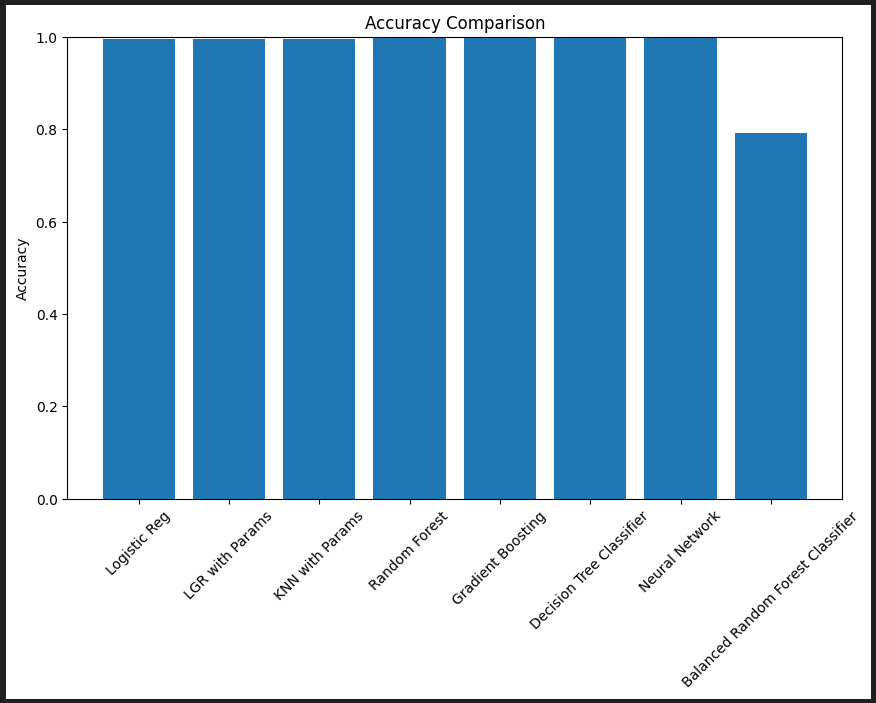 \
**Precision:** Measures the accuracy of positive predictions. \
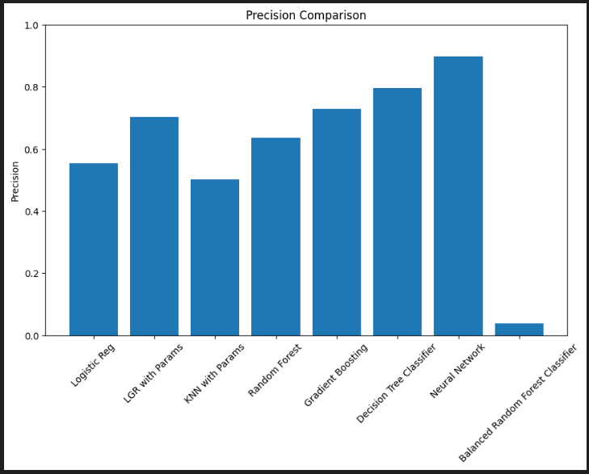 \
**Recall:** Measures the ability to identify all actual positive cases. \
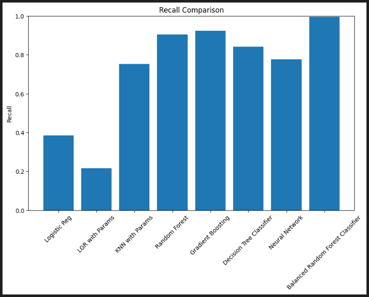 \
**Overall Results Comparison**: 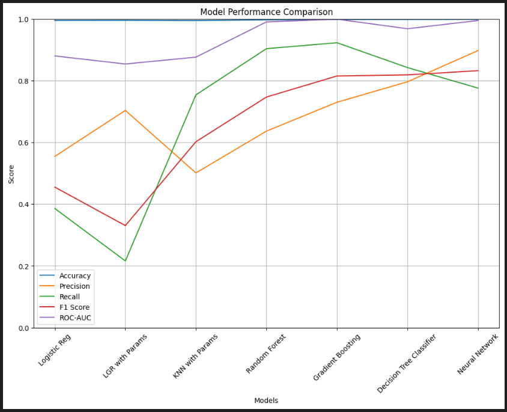

## Observations
**Accuracy:** All models, except for the Balanced Random Forest Classifier, achieved very high accuracy (>99%), indicating overall strong performance in predicting both fraud and non-fraud cases. The Neural Network model had the highest accuracy at 99.82%, followed closely by the Decision Tree Classifier (99.78%) and Gradient Boosting (99.75%).\
**Precision:** Precision measures the accuracy of positive predictions, crucial for minimizing false positives (correctly identifying actual fraud cases). The Neural Network model had the highest precision (89.72%), followed by the Decision Tree Classifier (79.60%) and Gradient Boosting (72.97%). The Balanced Random Forest Classifier had a significantly lower precision (3.91%), indicating a high number of false positives.\
**Recall:** Recall is particularly important in fraud detection to minimize false negatives (missing actual fraud cases). The Balanced Random Forest Classifier exhibited the highest recall (99.61%), indicating its ability to effectively capture actual fraudulent transactions among all true fraud cases. Gradient Boosting (92.25%) and Random Forest (90.33%) also showed strong recall performance.\
**F1 Score:** The F1 Score provides a balanced measure of precision and recall. The Neural Network model achieved the highest F1 score (83.19%), followed closely by the Decision Tree Classifier (81.84%) and Gradient Boosting (81.48%). The Balanced Random Forest Classifier had a very low F1 score (7.53%) due to its low precision.\
**ROC-AUC:** The ROC-AUC score reflects the model's ability to distinguish between fraud and non-fraud transactions. Gradient Boosting had the highest ROC-AUC score (99.87%), followed by the Neural Network (99.44%) and Random Forest (98.99%). The Balanced Random Forest Classifier also performed well in this metric with a ROC-AUC score of 99.57%.

## Model Evaluation on Test Data

The test data has been treated and processed the same way as the train data by applying standard scalers, encoders, adding, and removing appropriate columns. \ 
Upon processing data and passing it over to the trained models, the Neural Network performed the best. Other models couldn't perform well due to the highly imbalanced nature of the data. The confusion matrices for each of those models can be found in the Jupyter notebook file. The confusion matrix of the winning model is shown below.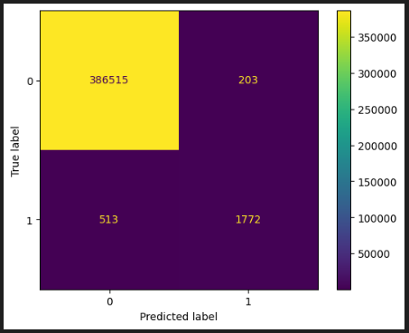

## Conclusion
Based on the provided performance metrics, the Neural Network model emerged as the top performer for predicting credit card fraud. It achieved the highest precision and a strong balance between recall and F1 score, making it effective at identifying fraudulent transactions while minimizing false positives. The Gradient Boosting model also demonstrated excellent performance across all metrics, particularly in recall and ROC-AUC, indicating its robustness in distinguishing between fraud and non-fraud transactions. \

While our model achieved strong results, there is still room for improvement as it failed to detect 513 fraudulent transactions. However, given the available resources, this is the best performance we could achieve with the current models. Future work can focus on further refining the model and exploring additional techniques to enhance fraud detection accuracy. 