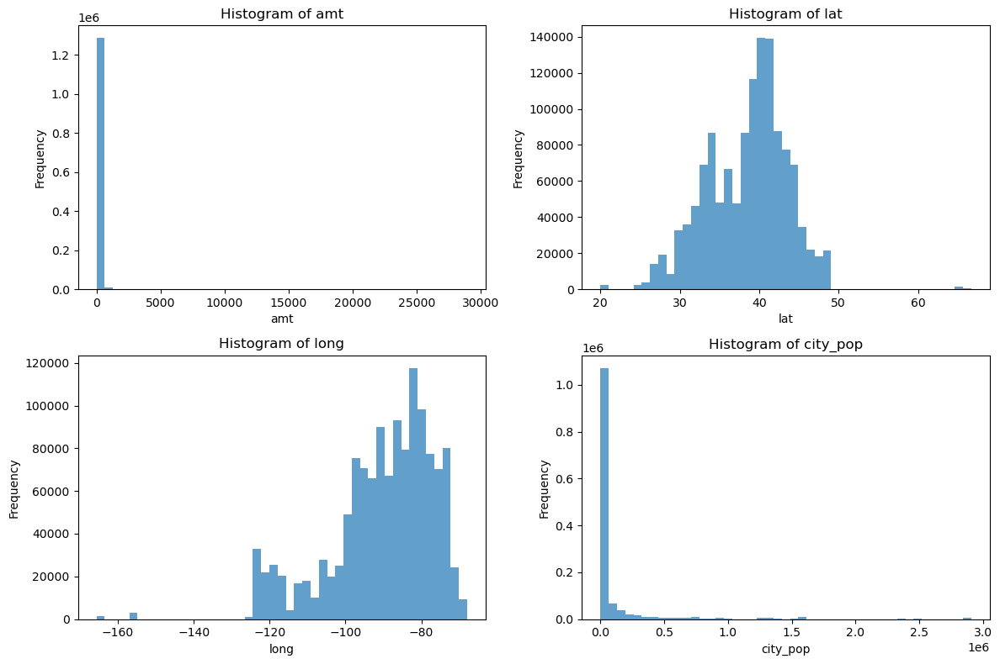

# Fraud Detection Project README

## Business Understanding

Fraud detection is a critical task in various industries such as banking, finance, and e-commerce. Detecting fraudulent activities early can save businesses significant losses and maintain trust with customers. In this project, we aim to develop a fraud detection model using machine learning techniques to identify potentially fraudulent transactions.

## Dataset

The data set is obtained from Kaggle here: <https://www.kaggle.com/datasets/kartik2112/fraud-detection>. It contains information about transactions, including numerical and categorical features. The target variable is 'is_fraud,' indicating whether a transaction is fraudulent (1) or not (0). There are 23 features in the dataset with below being the most important ones:

- Amt: Transaction amount
- Category: Transaction category
- Gender: The gender of the customer
- State: State of the transaction
- City_pop: Population of the city
- Job: Occupation of the customer
- Is_fraud: Target variable (1 for fraudulent transactions, 0 otherwise)

Other features include:

- Unnamed
- Trans_date_trans_time  
- Cc_num
- Merchant
- First
- Last
- Street
- City
- Zip
- Lat
- Long
- Dob
- Trans_num
- Unix_time
- Merch_lat
- Merch_long

## Exploratory Data Analysis (EDA) Steps

### Data Loading

Load the dataset into a DataFrame for analysis.

### Data Cleaning

Handle missing values, duplicate entries, and correct data types if needed. There are no missing values and there are no duplicates to clean up. And, that information is obtained upon checking the dataset.

### Data Visualization

1. Plotted histograms and box plots to understand the distribution of numerical features (amt, city_pop, etc.). and below are the outcomes of those plots.\
\
The histograms indicate that the amount and population columns are highly skewed with a majority of transaction amounts less than 5000 and a majority of cities with a population less than 0.5 mil.

2. Used bar plots to analyze categorical variables (category, gender, state, job) by counting unique values and their frequencies.\
2.1 Transactions By State\
\
2.2 Violin and box plots for amount, city population, lat and long.\
\
\
2.3 Transactions by Category.\
\
2.4 Transactions by Gender\

3. Explore correlations between features using heatmaps or scatter plots.\
3.1 Pair plot of important features\

### Feature Engineering

Create new features such as age from date of birth (dob) and extract temporal features like day of the week, month, and hour from timestamps (trans_date_trans_time).\

Encode categorical variables using techniques like label encoding.\
3.2 Heat map of important encoded features.\

### Fraud Analysis

1. Analyze the distribution of fraud labels (is_fraud) to understand the class balance and potential imbalances.\
The Below plots show how the data is highly imbalanced with less than 10000 fraud transactions for over a million total transactions.\
\

2. Compare statistical summaries and distributions of features between fraud and non-fraud transactions to identify patterns or anomalies.

    Fraud Statistics by gender, state and Hour of day\

    Fraud by State\

    Fraud by Age\
\

### Feature Importance

Determined feature importance using machine learning models (e.g., RandomForestClassifier) to understand which features contribute most to fraud detection.\

Feature Importance.\

The above graph shows that the amount has significant importance when determining which transaction could be a fraud one. Followed by category, hour and age.

### Outlier Analysis

As discussed above, there are outliers in the amt column of the data and the count of outliers (that are below the 25th quartile and above the 75th quartile) is: 67290

## Conclusion

Through exploratory data analysis (EDA), we gained insights into the dataset, identified relevant features for fraud detection, and performed necessary preprocessing steps. The feature importance analysis provided valuable information on which features are crucial for our fraud detection model.
